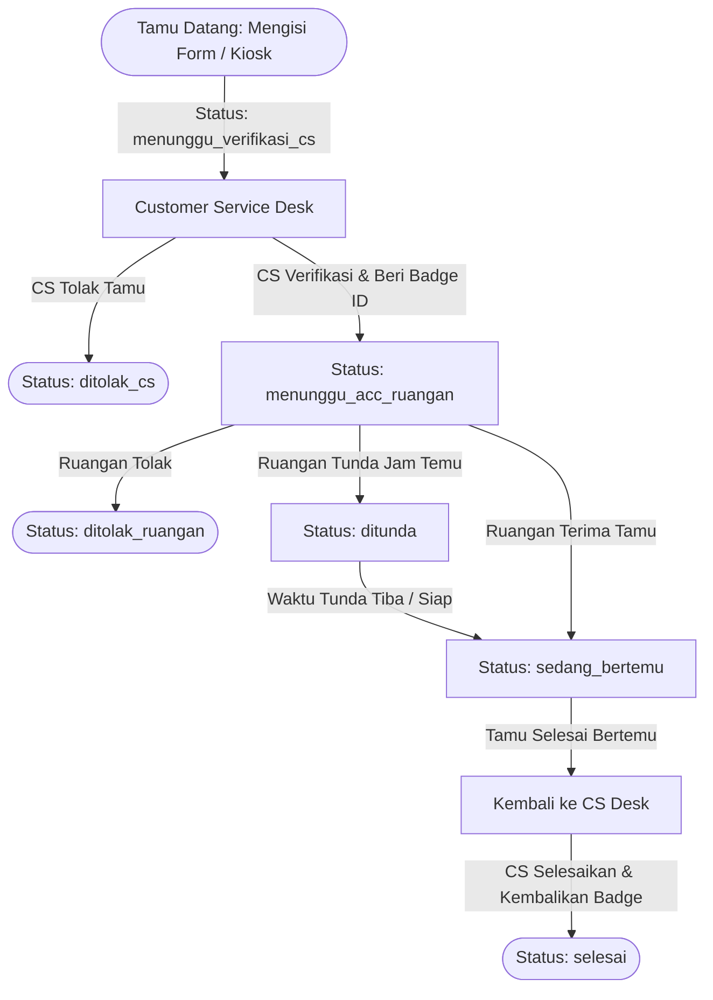
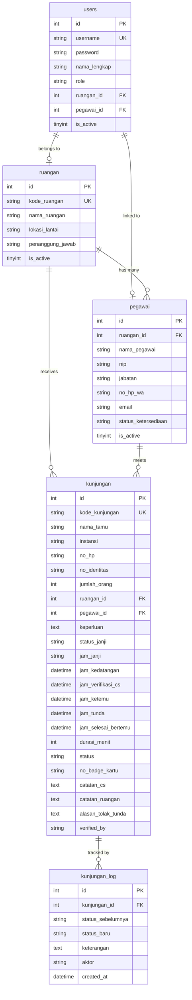

# 📘 DOKUMENTASI TEKNIS SISTEM BUKU TAMU DIGITAL
**RSUD Sidoarjo Barat — Sistem Manajemen Kunjungan Tamu Terpadu**

---

## 1. 📌 Ringkasan Eksekutif & Arsitektur Sistem

Aplikasi **Buku Tamu Digital** adalah sistem informasi berbasis web yang dirancang untuk mendigitalkan, memantau, dan mengelola alur kunjungan tamu di lingkungan rumah sakit/instansi pemerintah secara terpadu, akurat, dan *real-time*.

### 1.1 Karakteristik Arsitektur
- **Pola Desain**: MVC-Lite Berbasis Objek (OOP) & Prosedural Modular.
- **Bahasa Pemrograman**: PHP 8.x (Native murni, tanpa dependensi framework berat).
- **Akses Basis Data**: PHP Data Objects (PDO) dengan *Prepared Statements*.
- **Multi-Database Support**: Mendukung **MySQL / MariaDB** (Default) dengan fallback otomatis ke **SQLite** jika server MySQL tidak aktif.
- **Frontend & UI**: HTML5, Vanilla CSS3 (Custom Glassmorphism Design System), Bootstrap 5.3, Bootstrap Icons, SweetAlert2, QRCode.js, Chart.js.
- **Komunikasi Data**: AJAX / Fetch API untuk pembaruan data *real-time* (Monitor Antrean, Refresh Captcha, Update Ketersediaan).

---

## 2. 🏗️ Struktur Direktori Proyek

```plaintext
buku-tamu/
├── admin/                     # Modul Administrator
│   ├── laporan.php            # Laporan kunjungan, filter & ekspor Excel/CSV/Print
│   ├── master_pegawai.php     # Manajemen data master pejabat & pegawai
│   ├── master_ruangan.php     # Manajemen data master ruangan / unit kerja
│   └── master_user.php        # Manajemen akun pengguna dan hak akses
├── api/                       # RESTful / JSON Endpoints
│   ├── aksi_kunjungan.php     # Pemrosesan alur verifikasi, respon ruangan, & selesai
│   ├── captcha.php            # Generate & reload soal penjumlahan captcha matematika
│   ├── get_antrian.php        # Data antrean aktif real-time untuk monitor & live reload
│   ├── get_pegawai.php        # Dropdown dinamis daftar pegawai per ruangan
│   └── update_ketersediaan.php# Pembaruan status ketersediaan pejabat
├── assets/                    # Aset Statis
│   ├── css/style.css          # Desain sistem kustom modern glassmorphism
│   └── js/                    # Skrip JavaScript kustom
├── config/                    # Berkas Konfigurasi
│   ├── app.php                # Konfigurasi aplikasi, konstanta, sesi & URL deteksi
│   └── database.php           # Pengaturan koneksi MySQL & path fallback SQLite
├── cs/                        # Modul Customer Service / Front Office
│   ├── cetak_kartu.php        # Layout cetak kartu badge tamu
│   ├── index.php              # Dashboard CS, verifikasi tamu & penyelesaian kunjungan
│   └── ketersediaan.php       # Monitoring ketersediaan seluruh pejabat & kontak WA
├── helpers/                   # Fungsi Pembantu Global
│   └── functions.php          # Sanitasi data, flash message, format tanggal/waktu, RBAC guard
├── includes/                  # Komponen Template UI
│   ├── footer.php             # Template footer aplikasi
│   ├── header.php             # Template header HTML & stylesheet
│   ├── navbar.php             # Navigasi atas adaptif berdasarkan role login
│   └── sidebar_admin.php      # Navigasi khusus panel admin
├── models/                    # Data Access Layer & Business Logic
│   ├── Database.php           # Koneksi PDO, skema migrasi otomatis & seeding data awal
│   ├── Kunjungan.php          # Logika alur kunjungan, pencatatan log & statistik
│   ├── Pegawai.php            # Operasi CRUD master pegawai / pejabat
│   ├── Ruangan.php            # Operasi CRUD master ruangan / seksi
│   └── User.php               # Otentikasi pengguna, manajemen user & status ketersediaan
├── ruangan/                   # Modul Ruangan / Pejabat Tujuan
│   └── index.php              # Dashboard ruangan: terima, tunda, tolak tamu & status hadir
├── storage/                   # Penyimpanan file log, cache & file SQLite (db_buku_tamu.sqlite)
├── index.php                  # Halaman publik formulir pendaftaran tamu (Kiosk)
├── lacak.php                  # Halaman publik pelacakan status tiket kunjungan
├── login.php                  # Halaman otentikasi petugas dengan Captcha Matematika
├── logout.php                 # Handler logout & penghapusan sesi
├── monitor.php                # Display layar monitor TV antrean ruang tunggu
├── test_flow.php              # Unit test otomatis verifikasi alur kunjungan & status pejabat
└── tiket.php                  # Tampilan bukti tiket digital pendaftaran & QR code
```

---

## 3. 🔄 Alur Bisnis & State Machine Kunjungan

Alur siklus hidup setiap tamu yang berkunjung mengikuti *state machine* yang ketat dan terekam dalam log histori transaksi (`kunjungan_log`).



### 3.1 Transisi State & Pencatatan Waktu Otomatis

| Status | Aktor | Keterangan | Field Waktu yang Dicatat |
| :--- | :--- | :--- | :--- |
| `menunggu_verifikasi_cs` | Publik / Tamu | Tamu mendaftar melalui formulir publik/kios. | `jam_kedatangan = NOW()` |
| `ditolak_cs` | Customer Service | Kunjungan tidak memenuhi syarat/kebijakan. | `jam_verifikasi_cs = NOW()` |
| `menunggu_acc_ruangan` | Customer Service | CS memverifikasi identitas, memberi nomor badge tamu. | `jam_verifikasi_cs = NOW()`, `no_badge_kartu` |
| `ditolak_ruangan` | Ruangan / Pejabat | Pejabat berhalangan atau menolak kunjungan. | `alasan_tolak_tunda` |
| `ditunda` | Ruangan / Pejabat | Pejabat meminta waktu tunda (misal: ada rapat singkat). | `jam_tunda = HH:MM` |
| `sedang_bertemu` | Ruangan / Pejabat | Tamu diterima masuk ke ruangan pejabat. | `jam_ketemu = NOW()` |
| `selesai` | Customer Service | Tamu mengembalikan badge ke CS dan pulang. | `jam_selesai_bertemu = NOW()`, `durasi_menit` dihitung otomatis |

---

## 4. 🗄️ Skema Basis Data & Kamus Data

Sistem menggunakan 5 tabel utama dengan integritas referensial (*Foreign Keys*).



---

## 5. 🛡️ Fitur Keamanan Sistem

### 5.1 Otentikasi & Validasi Captcha Penjumlahan Matematika
Halaman otentikasi [`login.php`](file:///c:/xampp/htdocs/buku-tamu/login.php) dilengkapi sistem Captcha Penjumlahan Dinamis untuk mencegah serangan *Brute-Force* dan otomatisasi bot:
1. **Pembangkitan Angka Acak**: Pada setiap request atau klik tombol reload, sistem membangkitkan dua bilangan bulat acak `$num1` dan `$num2` (rentang 1–15).
2. **Penyimpanan Sesi Server**: Hasil penjumlahan disimpan dalam variabel sesi server `$_SESSION['login_captcha_sum']`. Nilai jawaban tidak pernah dikirim dalam teks mentah ke klien.
3. **Validasi Strict**: Sebelum memeriksa kecocokan username dan password, sistem memvalidasi bahwa `(int)$_POST['captcha'] === (int)$_SESSION['login_captcha_sum']`.
4. **Invalidasi Sesi**: Begitu verifikasi login berhasil atau gagal, sesi captcha direset untuk mencegah penggunaan ulang token (*anti-replay attack*).
5. **Dynamic Refresh API**: Endpoint [`api/captcha.php`](file:///c:/xampp/htdocs/buku-tamu/api/captcha.php) memungkinkan pergantian soal tanpa memuat ulang seluruh halaman web.

### 5.2 Enkripsi Password
Menggunakan algoritma hashing standar industri **BCrypt** melalui fungsi bawaan `password_hash($password, PASSWORD_BCRYPT)` dan `password_verify($password, $hash)`.

### 5.3 Role-Based Access Control (RBAC)
Pemberian hak akses dikontrol oleh fungsi middleware `requireLogin(array $allowedRoles)` pada [`helpers/functions.php`](file:///c:/xampp/htdocs/buku-tamu/helpers/functions.php):
- `admin`: Memiliki akses tak terbatas (Master Data, User Management, Laporan Seluruh Kunjungan).
- `cs`: Akses ke Dashboard Verifikasi Front Desk, Registrasi Kartu Badge, dan Cetak Tiket/Kartu.
- `ruangan`: Terbatas pada dashboard ruangannya sendiri, hanya dapat melihat dan memproses tamu yang ditujukan ke unit kerjanya, serta mengubah status ketersediaan pejabat.

### 5.4 Sanitasi Input & Proteksi SQL Injection
- Semua input formulir difilter menggunakan fungsi `clean()` (`htmlspecialchars(trim(...), ENT_QUOTES, 'UTF-8')`) untuk mencegah serangan *Cross-Site Scripting* (XSS).
- Seluruh query database mengeksekusi parameter bindings melalui PDO Prepared Statements (`$stmt->prepare()` & `$stmt->execute([...])`), mengeliminasi risiko *SQL Injection*.

---

## 6. 🌐 Dokumentasi API (Endpoints)

### 6.1 `GET /api/captcha.php`
Menghasilkan soal penjumlahan matematika baru untuk captcha login.
- **Request Headers**: `Accept: application/json`
- **Response Format**:
  ```json
  {
    "status": "success",
    "num1": 8,
    "num2": 5,
    "question": "8 + 5 = ?"
  }
  ```

### 6.2 `GET /api/get_antrian.php`
Mengambil data antrean tamu aktif untuk layar monitor TV atau widget live refresh.
- **Query Parameters**:
  - `ruangan_id` *(optional, integer)*: Filter antrean berdasarkan ID ruangan tertentu.
- **Response Format**:
  ```json
  {
    "status": "success",
    "total_antrian": 3,
    "statistik": {
      "total": 12,
      "menunggu_cs": 1,
      "menunggu_ruangan": 2,
      "sedang_bertemu": 3,
      "selesai": 6
    },
    "data": [
      {
        "id": 10,
        "kode_kunjungan": "TM-20260916-0001",
        "nama_tamu": "Budi Hartono",
        "instansi": "PT. Medika Sejahtera",
        "nama_ruangan": "Seksi Penunjang",
        "nama_pegawai": "Bapak B (Budi Santoso, S.Kom)",
        "keperluan": "Koordinasi Pengadaan Alkes",
        "status": "sedang_bertemu",
        "badge_html": "<span class=\"badge-status badge-status-success\">...</span>",
        "jam_kedatangan": "08:30 WIB",
        "jam_ketemu": "08:45 WIB",
        "jam_tunda": null,
        "no_badge_kartu": "BADGE-01"
      }
    ],
    "server_time": "09:30:00",
    "server_date": "Rabu, 16 September 2026"
  }
  ```

### 6.3 `GET /api/get_pegawai.php`
Mengambil daftar pegawai/pejabat berdasarkan ID ruangan untuk dropdown dinamis.
- **Query Parameters**:
  - `ruangan_id` *(required, integer)*: ID Ruangan.
- **Response Format**:
  ```json
  [
    {
      "id": 1,
      "nama_pegawai": "Bapak B (Budi Santoso, S.Kom)",
      "jabatan": "Kepala Seksi Penunjang",
      "status_ketersediaan": "Ada di Tempat"
    }
  ]
  ```

### 6.4 `POST /api/aksi_kunjungan.php`
Memproses aksi perubahan status alur kunjungan (CS & Ruangan).
- **Request Parameters (POST / Form-Data)**:
  - `id` *(integer, required)*: ID Kunjungan.
  - `aksi` *(string, required)*: Pilihan nilai:
    - `verifikasi_cs`: Memerlukan `no_badge_kartu`, `catatan_cs`, `verified_by`.
    - `tolak_cs`: Memerlukan `alasan_tolak`, `verified_by`.
    - `terima_ruangan`: Memerlukan `catatan_ruangan`, `nama_pejabat`.
    - `tolak_ruangan`: Memerlukan `alasan_tolak`, `nama_pejabat`.
    - `tunda_ruangan`: Memerlukan `jam_tunda`, `alasan_tunda`, `nama_pejabat`.
    - `selesai_cs`: Memerlukan `catatan_cs`, `cs_nama`.
- **Response Format**:
  ```json
  {
    "status": "success",
    "message": "Kunjungan DITERIMA! Jam mulai bertemu otomatis tercatat saat ini.",
    "data": { ... }
  }
  ```

### 6.5 `POST /api/update_ketersediaan.php`
Mengubah status ketersediaan pejabat yang sedang login.
- **Request Parameters (POST)**:
  - `status_ketersediaan` *(string, required)*: Nilai valid: `'Ada di Tempat'`, `'Sedang Rapat'`, `'Dinas Luar'`, `'Tidak di Tempat'`.
- **Response Format**:
  ```json
  {
    "status": "success",
    "message": "Status ketersediaan berhasil diubah menjadi: <strong>Sedang Rapat</strong>",
    "data": { ... }
  }
  ```

---

## 7. ⚙️ Petunjuk Instalasi & Deployment

### 7.1 Persyaratan Sistem
- **Web Server**: Apache 2.4+ atau Nginx.
- **PHP**: Versi 8.0 atau yang lebih baru dengan ekstensi: `pdo`, `pdo_mysql`, `pdo_sqlite`, `session`, `json`, `mbstring`.
- **Database Server**: MySQL 5.7+ / MariaDB 10.3+ (Opsional: fallback otomatis ke SQLite jika MySQL mati).

### 7.2 Langkah Instalasi (XAMPP di Windows)
1. Salin folder proyek ke direktori web root XAMPP:
   `C:\xampp\htdocs\buku-tamu`
2. Buka aplikasi **XAMPP Control Panel**, nyalakan modul **Apache** dan **MySQL**.
3. Buka browser dan akses alamat:
   `http://localhost/buku-tamu/`
4. **Auto Schema & Database Creation**:
   Sistem akan secara otomatis membuat database `db_buku_tamu`, seluruh tabel, data master ruangan, pegawai, dan akun pengguna default saat pertama kali diakses.

### 7.3 Pengujian Alur Otomatis
Jalankan verifikasi sistem melalui terminal/CLI:
```bash
cd c:\xampp\htdocs\buku-tamu
php test_flow.php
```
Jika seluruh pengujian menghasilkan tanda `(PASSED)`, sistem siap beroperasi penuh.
